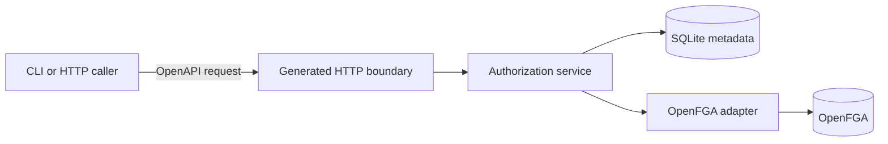
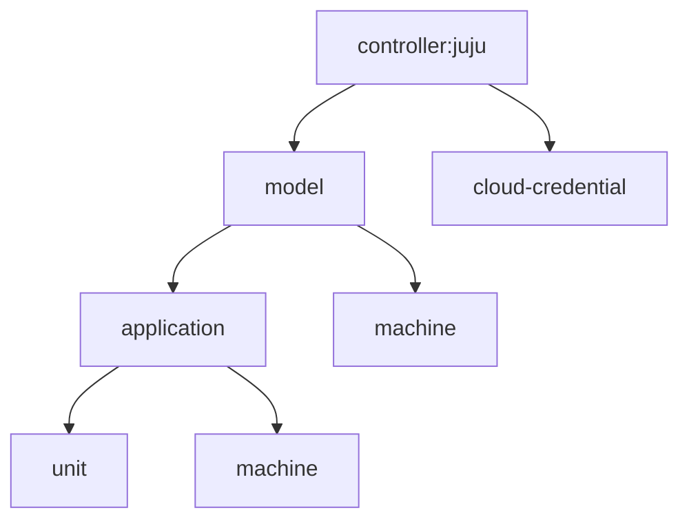

# Permissions API

This document describes the authorization concepts, HTTP contract, evaluation
path, and compatibility behavior implemented by the demo. The normative wire
contract is [`api/openapi.yaml`](api/openapi.yaml); this document explains how
its pieces work together.

## API boundary

All routes use the `/v1` base path. The OpenAPI specification generates:

* the strict `net/http` server interface implemented by `internal/httpapi`;
* request, response, and model types shared by the server; and
* the typed client used by `cmd/permissions-demo`.

Regenerate `api/api.gen.go` after changing the contract:

```text
go generate ./api
```

Application and CLI code do not call OpenFGA directly. They communicate in
Juju concepts -- permissions, resources, roles, groups, and bindings. The
server's OpenFGA adapter translates those concepts into relations and tuples.



## Demo identity

Except for `GET /v1/health`, every request must contain:

```text
X-Demo-User: alice
```

The header selects the **acting user** used to authorize the API operation. It
is deliberately not authentication: any caller can claim any identity. The
Compose stack binds the API to loopback because this mechanism is unsafe outside
a local demo.

The acting user and the principal in an authorization-check request are separate:

```json
{
  "principal": "bob",
  "permission": "application.config.write",
  "resource": {
    "type": "application",
    "id": "payments"
  }
}
```

Here, the header identifies who calls the API, while `principal` identifies
whose access is being queried. This demo permits any caller with a nonempty
header to query a decision; a production API would authorize access inspection.

## Authorization model

An authorization decision has three inputs:

```text
principal + permission + typed resource -> allow or deny
```

### Principals

A principal is a user ID, such as `alice`. Users can receive roles directly or
through group membership. The effective grants from all direct and group
bindings are additive.

There are no explicit deny rules. A request is denied when no applicable binding
provides the requested permission.

### Permissions

A permission is a stable operation name, not an HTTP route or role name. The
catalogue is returned by `GET /v1/permissions`.

| Family | Permissions |
| :---- | :---- |
| Policy | `policy.read`, `policy.manage` |
| Model | `model.read`, `model.create`, `model.delete` |
| Application read/lifecycle | `application.read`, `application.create`, `application.delete` |
| Application config | `application.config.read`, `application.config.write` |
| Unit | `unit.read`, `unit.create`, `unit.delete`, `unit.ssh` |
| Machine | `machine.read`, `machine.create`, `machine.delete`, `machine.ssh` |
| Cloud credential | `cloud-credential.read`, `cloud-credential.create`, `cloud-credential.delete` |

Each permission defines the resource type on which it is checked. Creation is
checked on the destination parent because the new resource does not exist yet.
For example:

* `model.create` is checked on `controller:juju`;
* `application.create` is checked on the destination model;
* `unit.create` is checked on the destination application; and
* `machine.create` is checked on either a model or application.

### Resources and hierarchy

Resources use a type and immutable ID:

```json
{
  "type": "unit",
  "id": "payments-0"
}
```

The implicit root is `controller:juju`. The supported containment graph is:



Models and cloud credentials are siblings. Applications belong to models. Units
belong to applications. A machine can belong directly to a model or to an
application.

A parent relationship does not grant every operation automatically. The OpenFGA
model names the descendant relations that may flow from each parent. A role must
explicitly contain `unit.ssh` for a model-scoped binding to permit SSH on units
inside that model.

### Roles

A role is a named permission bundle:

```json
{
  "name": "unit-operator",
  "description": "Read and SSH to selected units",
  "permissions": [
    "unit.read",
    "unit.ssh"
  ]
}
```

Application endpoints check permissions, never role names. This permits role
contents to change without changing enforcement code.

Built-in roles are immutable. Custom roles are mutable and carry an integer
revision. Updating a custom role requires its current revision in `If-Match`:

```text
If-Match: 1
```

`POST /v1/roles/{roleId}/preview` validates the proposed permissions against all
existing bindings and reports:

* added and removed permissions;
* the current role revision; and
* the number of affected bindings.

`PUT /v1/roles/{roleId}` applies the same change. A stale revision produces
`409 Conflict`. Successful mutation increments the revision and changes every
binding that refers to that role.

### Groups

A group contains users but has no permissions by itself. A role binding gives a
group authority. OpenFGA represents a group binding as a userset, so all current
group members receive it. Adding or removing a member changes effective access
without changing the binding.

Groups cannot contain other groups in this demo.

### Bindings

A binding connects a user or group to a role:

```text
subject + role + scope + selector
```

For example:

```json
{
  "subject_type": "group",
  "subject_id": "release-team",
  "role_id": "application-config-editor",
  "scope": {
    "type": "model",
    "id": "production"
  },
  "selector": {
    "match": "exact",
    "resources": [
      {
        "type": "application",
        "id": "payments"
      }
    ]
  }
}
```

A binding has one of two selector modes.

#### Scope selector

```json
{
  "match": "scope"
}
```

The role is applied at the binding scope. Permissions targeting descendants are
written as scope relations and flow through explicit OpenFGA parent rules. For
example, binding a role containing `application.read` and `unit.read` at
`model:production` applies those operations to matching applications and units
under that model, including resources created later.

Scope alone grants nothing. Only permissions explicitly present in the role can
flow to descendants.

#### Exact selector

```json
{
  "match": "exact",
  "resources": [
    {"type": "unit", "id": "payments-0"}
  ]
}
```

Each permission is written directly against compatible selected resources. An
exact unit selection does not grant access to sibling units or its application.
All selected resources must be the scope itself or descendants of it.

Every role permission must match at least one selected resource type. A role
containing only `machine.ssh` cannot be bound to an exact list containing only
units.

## Decision evaluation

`POST /v1/authorize` checks one decision. The service performs these steps:

1. Validate the principal, permission name, resource type, and resource ID.
2. Confirm that the resource exists in the demo metadata store.
3. Map the permission to an OpenFGA relation for that resource type.
4. Ask OpenFGA whether `user:<principal>` has that relation on the object.
5. Return an allow or deny decision.

An allow response resembles:

```json
{
  "allowed": true,
  "reason": "allowed by an applicable direct or group role binding",
  "permission": "application.config.write",
  "resource": {
    "type": "application",
    "id": "payments"
  }
}
```

A normal denial is also a successful `200 OK` decision:

```json
{
  "allowed": false,
  "reason": "no matching binding",
  "permission": "machine.ssh",
  "resource": {
    "type": "machine",
    "id": "model-0"
  }
}
```

`POST /v1/authorize/batch` accepts up to 50 checks and returns decisions in the
same order. The demo currently evaluates them one at a time through the same
single-check path.

The business endpoints call this same service internally. For example:

* listing resources evaluates each resource's read permission and omits denied
  resources;
* reading or writing application config checks
  `application.config.read` or `application.config.write`; and
* simulated SSH checks `unit.ssh` or `machine.ssh`.

## Policy management authorization

Policy management is itself authorized:

* listing roles, users, groups, or bindings requires `policy.read` on
  `controller:juju`;
* creating users, groups, roles, or changing membership requires
  `policy.manage` on `controller:juju`; and
* creating or deleting a binding requires `policy.manage` at its enclosing
  model or controller policy scope.

For an application-, unit-, or machine-scoped binding, the server walks resource
parents until it reaches the enclosing model. Exact resources are checked to
ensure they remain inside the declared binding scope.

The demo does not yet enforce delegation subsets. A caller with `policy.manage`
can assign a role even when the caller does not personally hold every permission
in that role.

## Legacy grant and revoke

The legacy endpoints preserve the coarse model vocabulary used by `juju grant`:

| Legacy access | Server-owned role |
| :---- | :---- |
| `read` | `model-reader` |
| `write` | `model-writer` |
| `admin` | `model-admin` |

`POST /v1/legacy/grants` accepts only the coarse intent:

```json
{
  "user_id": "alice",
  "model_id": "production",
  "access": "write"
}
```

The server selects the compatibility role and creates or replaces a marked
model-scope binding. The client does not enumerate fine-grained permissions.
Consequently, an older client still receives the compatibility bundle defined by
the current server.

`POST /v1/legacy/revokes` preserves downgrade behavior:

```text
admin -> write -> read -> no compatibility binding
```

The requested access must match the user's current compatibility role. This
prevents a mismatched revoke from accidentally upgrading access. Revoking a
compatibility binding does not remove access supplied by a custom or group
binding. The response's `still_authorized` field reports whether `model.read`
remains effective after the change.

## Resource operations

The generic resource endpoints use the following rules:

| Operation | Authorization |
| :---- | :---- |
| List resources | Check the corresponding `*.read` permission per item and filter denied items. |
| Get a resource | Check the resource's `*.read` permission. |
| Create a resource | Check the corresponding `*.create` permission on its parent. |
| Delete a resource | Check the corresponding `*.delete` permission on the resource. |

Resource creation validates the allowed parent type. Deletion currently supports
only leaf resources; a resource with children returns `409 Conflict`.

Deleting a resource does not currently normalize binding targets into foreign-key
rows. This demo should therefore avoid deleting a resource referenced by a
binding.

## OpenFGA translation

OpenFGA remains behind the provider boundary. The adapter uses these objects:

* `user:<id>` for users;
* `group:<id>#member` for group membership;
* `grant:<binding-id>#subject` as an indirection for each binding; and
* typed resource objects such as `model:production` and
  `application:payments`.

A binding to Alice is represented conceptually as:

```text
user:alice --subject--> grant:<binding-id>
grant:<binding-id>#subject --unit_ssh--> model:production
```

The second tuple can be attached to the scope or to exact resources. The grant
object keeps role-derived tuples separate for each binding and supports replacing
one binding without deleting authority supplied by another.

Resource containment is represented with `parent` tuples. The immutable
OpenFGA model in `internal/openfga/model.fga` controls which relations propagate
from each parent type.

## Metadata and synchronization

SQLite stores:

* users, groups, and memberships;
* role metadata and role permissions;
* bindings and selectors;
* resources and parent references; and
* the IDs of the OpenFGA store and authorization model.

After a policy or hierarchy mutation, the service computes the complete desired
set of managed OpenFGA tuples, compares it with its last synchronized projection,
and writes the difference. The same reconciliation runs during server startup.
OpenFGA makes authorization decisions; SQLite supplies the management metadata
needed to construct its relationship tuples.

This is a demo-level reconciliation mechanism, not a distributed transaction or
production outbox implementation.

## Endpoint summary

| Area | Operations |
| :---- | :---- |
| Health | `GET /v1/health` |
| Permission catalogue | `GET /v1/permissions` |
| Decisions | `POST /v1/authorize`, `POST /v1/authorize/batch` |
| Users | `GET /v1/users`, `POST /v1/users` |
| Groups | `GET /v1/groups`, `POST /v1/groups`, add/remove membership |
| Roles | list, create, get, preview update, update |
| Bindings | list, create, delete |
| Legacy model access | grant and revoke compatibility access |
| Resources | list, create, get, delete |
| Application config | read and update |
| SSH simulation | unit and machine operations |

For exact schemas, status codes, request bodies, and response bodies, use
[`api/openapi.yaml`](api/openapi.yaml).

## Error and decision semantics

The common error body is:

```json
{
  "code": "forbidden",
  "message": "forbidden"
}
```

The intended status meanings are:

| Status | Meaning |
| :---- | :---- |
| `200` | Successful operation or a completed allow/deny decision. |
| `201` | Resource, user, group, role, or binding created. |
| `204` | Membership or binding removed. |
| `400` | Invalid input or incompatible role/binding definition. |
| `401` | `X-Demo-User` is missing. |
| `403` | The acting user lacks the permission required by the operation. |
| `404` | Referenced metadata does not exist. |
| `409` | Duplicate data, stale role revision, or non-leaf resource deletion. |
| `503` | The authorization engine cannot complete a decision. |

A denied authorization decision is not an API error. It returns `200` with
`allowed: false`. An inability to obtain a decision fails closed and is reported
as an error.

## Demo limitations

The API deliberately omits several production requirements:

* real authentication and trusted identity claims;
* role-binding expiry and conditional access;
* nested groups;
* full privilege-delegation checks;
* authorization of another principal's effective-access inspection;
* list pagination, watches, and field-level filtering;
* a production transactional outbox and distributed reconciliation protocol;
* role and binding deletion lifecycle safeguards; and
* migration, backup, multi-controller tenancy, and model-version rollout.
