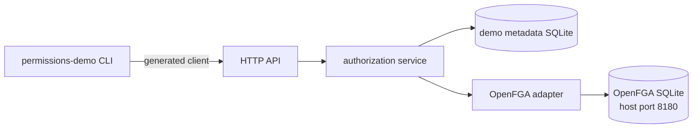

# Juju fine-grained permissions demo

This standalone demo illustrates the boundary between:

* a generated, Juju-owned HTTP API;
* a generated client used by a small CLI; and
* OpenFGA as the permission engine behind a provider adapter.

It is intentionally not production code. In particular, `--as USER` becomes the
`X-Demo-User` header without authentication.

## Architecture



`api/openapi.yaml` is the source of truth. `oapi-codegen` generates both the
strict `net/http` server interface and the typed client in `api/api.gen.go`.
Handwritten handlers implement the generated interface.

See [`PERMISSIONS_API.md`](PERMISSIONS_API.md) for the authorization concepts,
endpoint behavior, hierarchy rules, decision flow, and OpenFGA translation.

The OpenFGA schema models this resource hierarchy:

```text
controller:juju
├── model
│   ├── application
│   │   ├── unit
│   │   └── machine
│   └── machine
└── cloud_credential
```

A role is a data-driven permission bundle. A binding connects a user or group to
a role at either a scope or an exact resource selection. Scope bindings compile
role permissions into relations on the scope object; OpenFGA's parent relations
carry only explicitly modelled descendant permissions.

## Run the demo

Start the complete stack:

```text
make up
```

In another terminal, build the generated-client CLI:

```text
go build -o bin/permissions-demo ./cmd/permissions-demo
```

The database is seeded with:

* user `admin`, bound to `controller-superuser`;
* model `production`;
* application `payments`;
* unit `payments-0`;
* model-scoped machine `model-0`;
* application-scoped machine `payments-machine`; and
* cloud credential `aws-production`.

List the seeded resources as the bootstrap administrator:

```text
bin/permissions-demo --as admin resources list
```

Create a user and grant legacy model read access. The CLI sends only `read`; the
server selects the complete `model-reader` compatibility role:

```text
bin/permissions-demo --as admin users create alice
bin/permissions-demo --as admin grant alice read production
bin/permissions-demo --as alice resources list
bin/permissions-demo --as alice ssh unit payments-0
```

The last command is denied because model read does not include `unit.ssh`.
Create a narrow SSH role and bind it to one exact unit:

```text
bin/permissions-demo --as admin roles create unit-ssh \
  "SSH to selected units" unit.read,unit.ssh
bin/permissions-demo --as admin bindings create user alice unit-ssh \
  model:production exact unit:payments-0
bin/permissions-demo --as alice ssh unit payments-0
bin/permissions-demo --as alice ssh machine model-0
```

The unit command is allowed and the machine command is denied. This demonstrates
that containment alone grants nothing that the role does not explicitly include.

Create a group with application-configuration authority:

```text
bin/permissions-demo --as admin users create bob
bin/permissions-demo --as admin groups create release-team
bin/permissions-demo --as admin groups add-member release-team bob
bin/permissions-demo --as admin bindings create group release-team \
  application-config-editor model:production exact application:payments
bin/permissions-demo --as bob config set payments channel=stable replicas=3
```

Check a decision directly:

```text
bin/permissions-demo --as admin can bob application.config.write application:payments
```

Inspect all commands with:

```text
bin/permissions-demo --help
```

Stop the stack with `make down`. Run `make reset` to remove both SQLite volumes
when a clean demonstration is required.

## API and code generation

Regenerate and compile the contract with:

```text
make generate
make build
```

The OpenAPI contract exposes:

* permission discovery and single/batch decisions;
* user, group, role, membership, and binding management;
* legacy model grant/revoke adaptation;
* filtered resource reads plus resource creation/removal;
* application configuration; and
* simulated unit and machine SSH operations.

`If-Match` protects mutable role updates. `roles preview` reports the permission
diff and number of affected bindings before `roles update` changes the role.

## Important simplifications

* The demo uses one controller and one OpenFGA store.
* It does not implement real authentication, expiry, conditions, audit queries,
  model migration, watches, or full delegation subset checks.
* OpenFGA is authoritative for decisions; SQLite stores demo resources and the
  metadata needed to manage roles and bindings. Startup reconciliation repairs
  the tuple projection.
* Resource deletion is limited to leaves so the example does not hide lifecycle
  or cascading authorization decisions.
